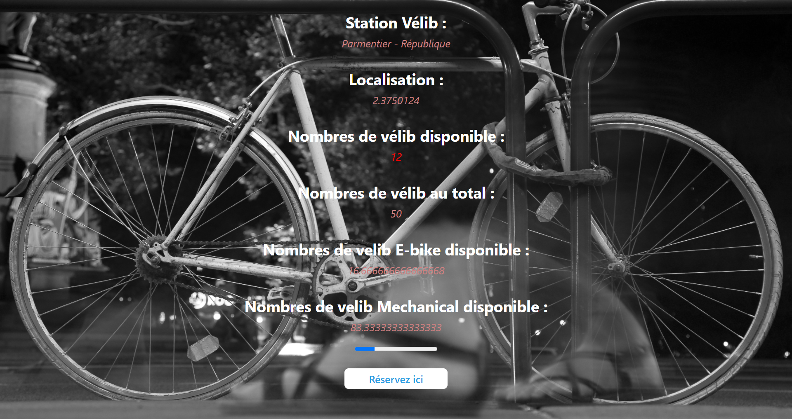

# Project Javascript API Velib

#### The main objective of this site is to retrieve data from an electric scooter terminal API and to display this data in JavaScript. The information of this terminal is located in **Parmentier, France.**
##### The API used for this project is available [here](https://opendata.paris.fr/api/records/1.0/search/?dataset=velib-disponibilite-en-temps-reel&q=stationcode=11105&facet=station_state&facet=kioskstate&facet=creditcard&facet=overflowactivation)

###### Below is a representation of the project.

